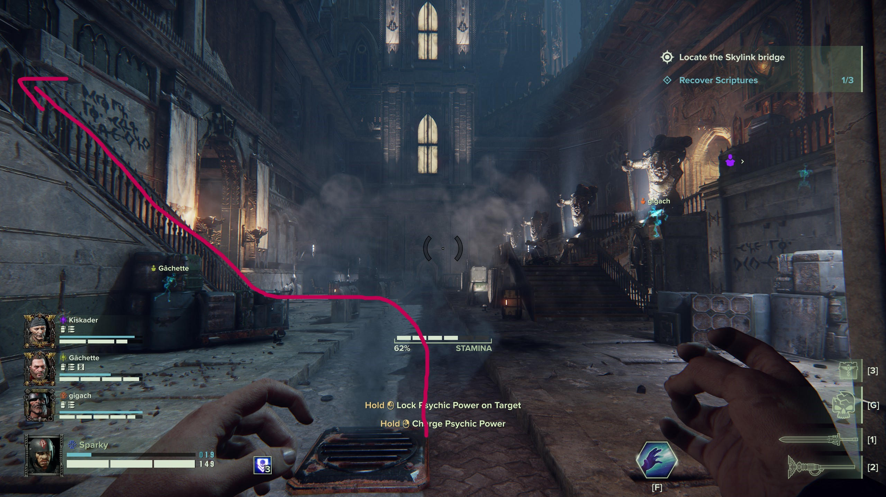
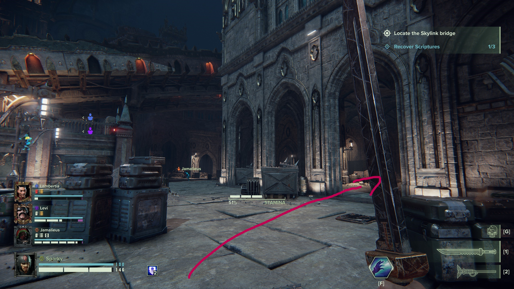
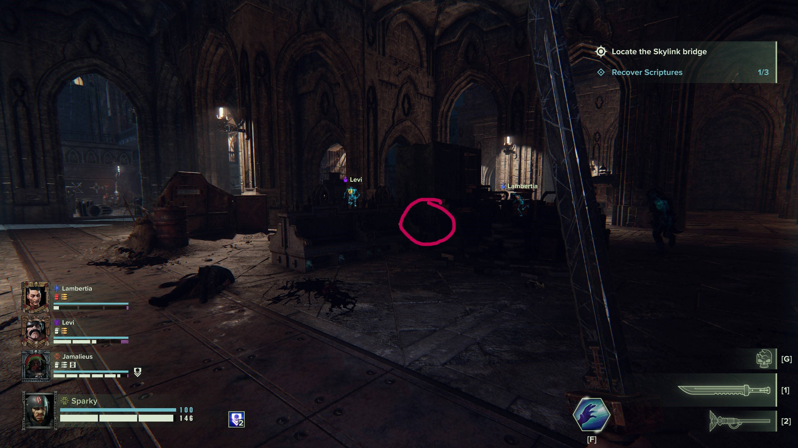
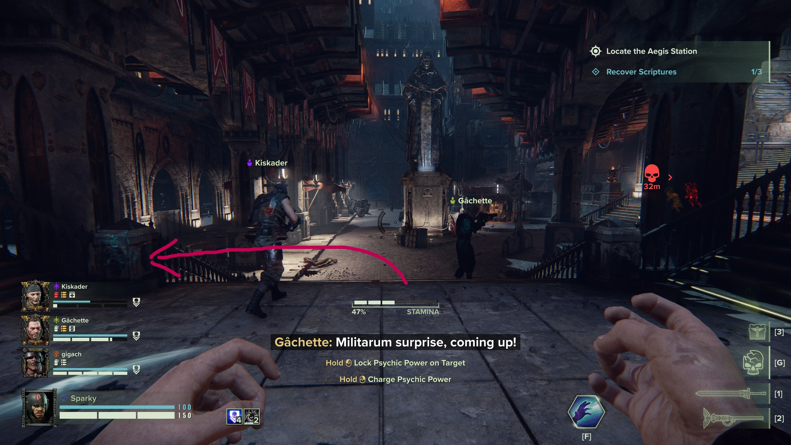
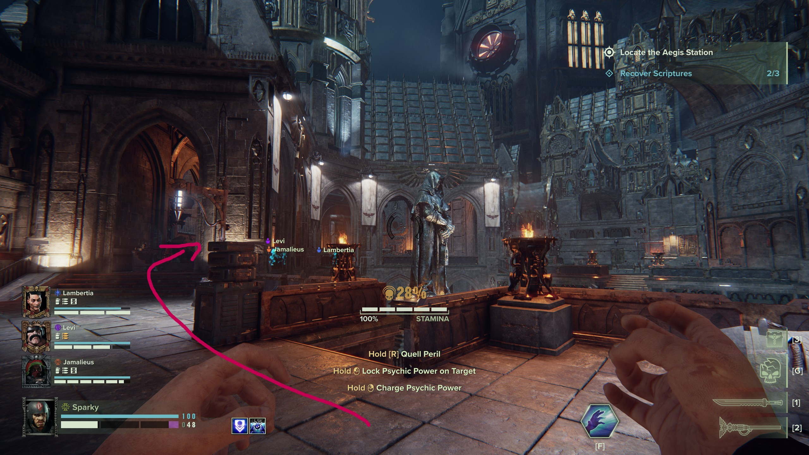
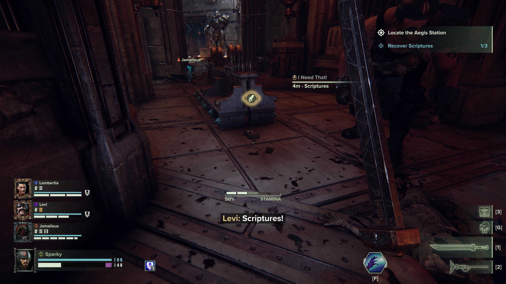

## Location 1
before you go to the next section, turn around and follow up the stairs

.jpg)
## Location 2
After the drop down before you let down the bridge, follow the wall until you see benches with books

## Location 3
After you crossed the bridge and went down the stairs, turn left 

.jpg)
## Location 4
At the Statue, follow the path to the left through the hallway with the benches

