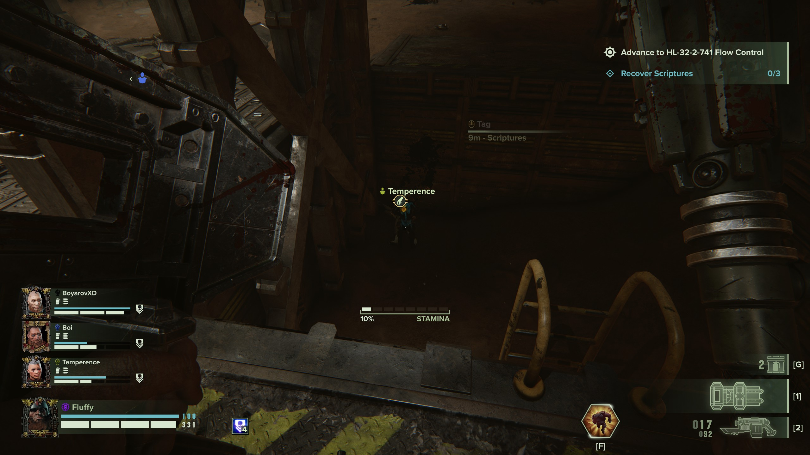
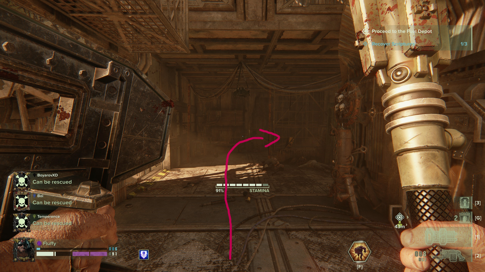

## Location 1
At the beginning in the second hangar before you get up to the elevator. The Scripture is under the elevator

## Location 2
After first drop, turn around and enter the building on the left the location should be on the right site
.png)

## Location 3
After the hangar you walk through a sandy way before you head up the stairs, turn around and keep right. Jump over to the other side, the Scripture should sit on the window frame

## Location 4
In between the sections after you move up the stairs

## Location 5
When you enter the outside section, follow the stairs down until you see a room with a fence

## Location 6
When you enter the outside section, follow the stairs down and head as far right as possible and look for the market stall

## Location 7
before you enter the scanner, go up the stair to the right, follow them to the red room, the scripture is on the other side

